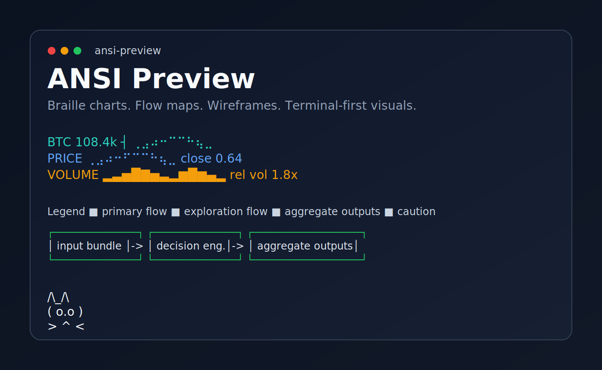

# ANSI Preview

Braille charts. Flow maps. Wireframes. Terminal-first visuals.

> A lightweight Codex skill pack for clean ANSI truecolor previews: braille charts, flow maps, wireframes, tables, and terminal-first visual thinking.



## What This Is

`ansi-preview` is a small public skill pack for turning requests like:

- `visualize it`
- `graph it`
- `show the flow`
- `preview the layout`
- `show it as ANSI truecolor terminal chart with price and volume`

into compact, readable terminal visuals.

It is designed to work well for:

- Codex users via `SKILL.md`
- Claude users via `CLAUDE.md` and `.claude/commands/ansi-preview.md`
- GitHub readers via screenshots, SVGs, and copy-paste-friendly examples

## Why This Format Works

- fast first-look inspection
- often cheaper than HTML, SVG, or long prose for early thinking
- braille charts carry more curve detail per cell
- easy to paste into chats, issues, docs, and PRs
- strong bridge between plain text and richer UI work

## Use With Codex

Copy this repo's portable core into a skill directory:

```text
.codex/skills/ansi-preview/
├── SKILL.md
├── agents/openai.yaml
└── references/patterns.md
```

Good install targets:

- repo-local: `.codex/skills/ansi-preview`
- user-global: `~/.codex/skills/ansi-preview`

## Use With Claude

This repo also includes:

- `CLAUDE.md` for project-level guidance
- `.claude/commands/ansi-preview.md` for a reusable slash command prompt

Useful install targets:

- repo-local `CLAUDE.md`
- repo-local `.claude/commands/ansi-preview.md`
- or copy the command text into your own Claude command library

## Gallery

### Smooth Braille Chart

```ansi
BTC  108.4k ┤                ⢀⣠⠴⠒⠉⠉⠓⢦⣀
     106.2k ┤          ⢀⡴⠋              ⠙⢦⡀
     104.0k ┤      ⢀⡴⠋                    ⠘⣆
     101.8k ┤  ⢀⡴⠃                        ⠘⣆
      99.6k ┼⠤⠋                            ⠈⠒
              09:00      12:00      15:00      18:00
```

### Price + Volume

```ansi
PRICE   ⢀⣠⠴⠒⠋⠉⠉⠓⢦⣀      close 0.64
VOLUME  ▂▃▅█▇▅▃▂▆█▆▄▂      rel vol 1.8x
```

### Parallel System Flow

```ansi
Legend  ■ primary flow  ■ exploration flow  ■ aggregate outputs  ■ caution

                        CURRENT SYSTEM OVERVIEW

         PRIMARY PATH                                  EXPLORATION PATH
┌───────────────────────────────┐              ┌──────────────────────────────────────────┐
│ input bundle / live event     │              │ input bundle                             │
│ states, scores, tags, timing  │              │ states, scores, history, windows         │
└──────────────┬────────────────┘              └───────────────────┬──────────────────────┘
               │                                                   │
               ▼                                                   ▼
┌───────────────────────────────┐              ┌──────────────────────────────────────────┐
│ decision engine               │              │ summarize_state_trajectory()             │
│ pick leader                   │              │                                          │
│ score confidence / entry      │              │ per step computes:                       │
└──────────────┬────────────────┘              │ • center / spread                        │
               │                               │ • confidence gap                         │
               ▼                               │ • nearby support                         │
┌───────────────────────────────┐              │ • protected zone around center           │
│ routing layer                 │              └───────────────────┬──────────────────────┘
│ hold / refresh rules          │                                  │
│ exit if leader changes        │                                  ▼
└──────────────┬────────────────┘              ┌──────────────────────────────────────────┐
               │                               │ expand each step into candidate rows      │
               ▼                               │ row = moment × target                     │
┌───────────────────────────────┐              │                                          │
│ execution loop                │              │ per row stores:                          │
│ sort by entry score           │              │ • rank / priority                        │
│ final score = confidence      │              │ • role = center / nearby /               │
└──────────────┬────────────────┘              │   protected / outside                    │
               │                               │ • locked gain / locked risk              │
               ▼                               │ • change_1 / drift_1                     │
┌───────────────────────────────┐              └───────────────────┬──────────────────────┘
│ aggregate outputs             │                                  │
│ reports / alerts / logs       │                                  ▼
└───────────────────────────────┘              ┌──────────────────────────────────────────┐
                                               │ review tables / summary views            │
                                               │ compare patterns and refine rules        │
                                               └──────────────────────────────────────────┘
```

### Funny ANSI Cat

```ansi
 /\_/\\
( o.o )
 > ^ <
```

## Prompt Examples

- `Use $ansi-preview to show this as a smooth braille chart.`
- `Use $ansi-preview to show it as ANSI truecolor terminal chart with price and volume.`
- `Use $ansi-preview to sketch this UI in terminal first.`
- `Use $ansi-preview to map this flow with several boxes and a legend.`
- `Use $ansi-preview to compare these variants in one compact table.`

## Visual Language

### Chart Modes

- `braille raster`: dense or smooth series
- `block sparkline`: tiny summaries
- `half-block / quadrant`: simplified shape with more weight
- `box-drawing scaffold`: wireframes, flows, structural diagrams

### Legend Convention

- `primary flow`: green or main accent
- `exploration flow`: cyan
- `aggregate outputs`: blue
- `caution`: amber
- `neutral context`: gray

If color drops out, labels and geometry should still make the preview readable.

## Compatibility

- best experience: truecolor terminal with braille and box-drawing support
- good fallback: 256-color terminal
- safe fallback: monochrome Unicode
- richer-than-Unicode terminal ask: Sixel or Kitty

## Publishing Notes

There is no special packaging step required for this repo to be useful.
The practical public distribution path is:

1. publish the repo on GitHub
2. keep the core skill files stable
3. show screenshots or SVG previews in `assets/`
4. document Codex and Claude install paths clearly

## License

MIT
